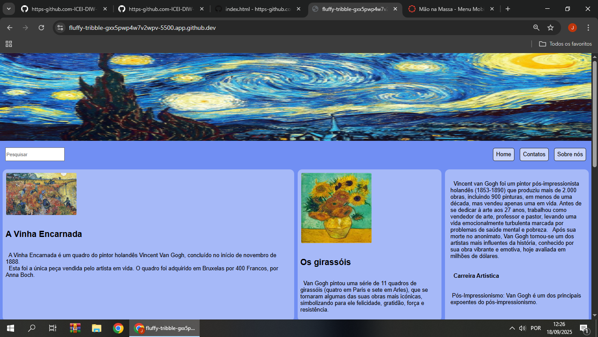
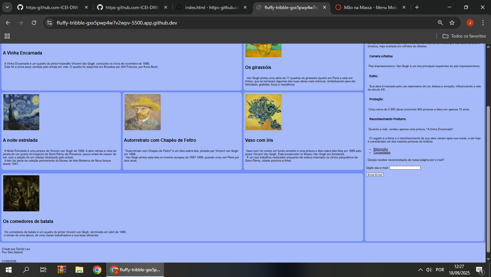
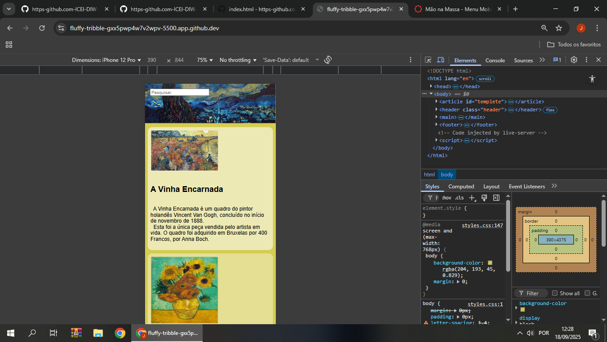
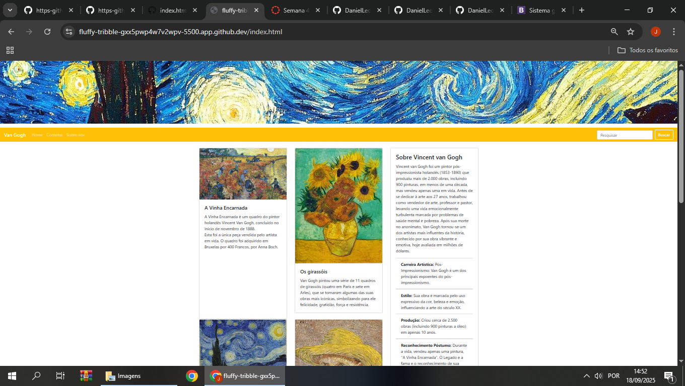
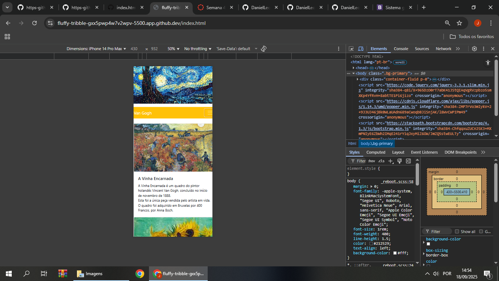

# Trabalho Prático - Semana 04 e 05

Nessa atividade, vamos dar sequência ao projeto iniciado na semana passada. Se você ainda não fez o projeto da semana anterior, fique atento, se programe e procure colocar as atividades em dia. Volte lá, leia tudo e faça sua parte pois essa atividade depende da atividade anterior.

No trabalho dessa semana vamos evoluir o projeto para que a home-page funcione bem tanto no celular quanto no desktop.

**IMPORTANTE 1:** Estaremos utilizando uma ferramenta de verificação automática para te ajudar a identificar se você conseguiu fazer o que é necessário. Essa ferramenta é o autograder e todas as vezes que você submeter o repositório ao GitHub via **`git push`**, será gerado um arquivo **`relatorio.md`** na raiz do seu repositório com detalhes da correção. Para continuar trabalhando no seu computado, será importante realizar o comando **`git pull origin main`** para atualizar sua versão local com o relatório gerado no GitHub. **FIQUE ATENTO**

**IMPORTANTE 2:** Você deve alterar apenas os arquivos **`README.md`**, **`index.html`** e **`css/styles.css`**, podendo incluir outros arquivos como imagens na pasta **`images`**, caso necessário. Deixe todos os demais arquivos e pastas desse repositório inalterados. **PRESTE MUITA ATENÇÃO NISSO.**

## Informações Gerais

- Nome: Daniel Junio Leo
- Matricula: 900673
- Proposta de projeto escolhida: Proposta 4-Coleções e Itens.
- Breve descrição sobre seu projeto:  Fiz um site que mostra e comenta sobre algumas obras de arte do artista Vincent van Gogh.

## Print da versão responsiva com CSS puro [DESKTOP]

 

 

## Print da versão responsiva com CSS puro [MOBILE] (*)

(*) Utilize as ferramentas do desenvolvedor do seu navegador para colocar no modo reponsivo, escolha um celular qualquer e recarregue a página antes de tirar o print. 

## Print da versão responsiva com Bootstrap [DEKTOP] (*)

## Print da versão responsiva com Bootstrap [mobile] (*)

